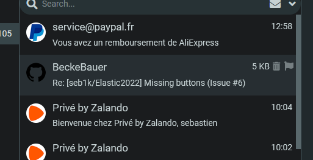

# Elastic2022

Elastic2022 is a Roundcube skin based on Elastic

- Design changed to fit android dark theme.
- Better user interface
- Modern menus
- Plugin support
- New Dark / Light mode

## New features
### Pull down to refresh email

### Email autoresize

### Contact thumbail

## Screenshot

## Install

    Place Elastic2022 folder in the roundcube skins folder (skins)

## 

If you like this skin, please give it a star !

If you want to help me improve it, consider making a donation : 

Topic on the roundcube's forum :
https://www.roundcubeforum.net/index.php/topic,29883.0.html
