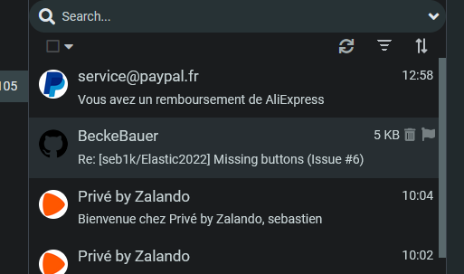
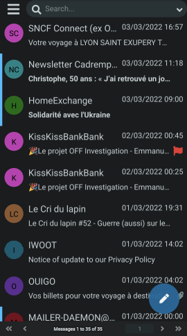

# Elastic2022


Elastic2022 is a Roundcube skin based on Elastic


- Design changed to fit android dark theme.
- Better user interface
- Modern menus
- Plugin support
- New Dark / Light mode
- PWA support


## New features
### Pull down to refresh email


### Email autoresize to fit screen


### New menus


### Contact thumbail


### Important email icon


## Screenshot





## Installation
### With composer
```
composer require seb1k/elastic2022:dev-main
```
### Manual
Put all the files in a `elastic2022` subfolder of the the Roundcube's `skins` folder


## 

If you like this skin, please give it a star !

Or help me improve it : [](https://www.paypal.com/donate/?hosted_button_id=AQHZNZT5L7JSE)


Topic on the roundcube's forum :
https://www.roundcubeforum.net/index.php/topic,29883.0.html
